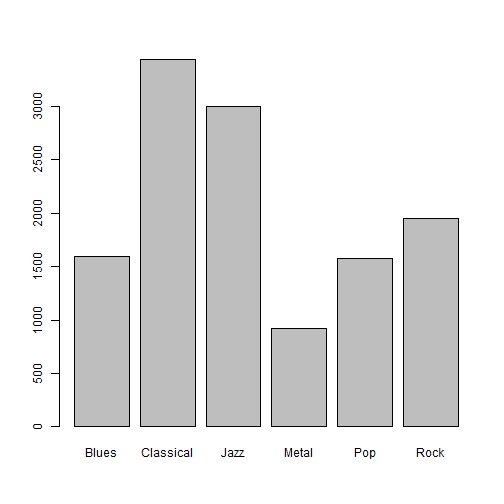

1.a
Classify music into six catagories
12,495 music samples 191 predictors.


In this situation, since the sample size is large it is possible to 
set aside a testing data set and training data set.
regardless of the artist, the underlying connection between songs, it is possible to
catagorise the songs to different genres.
since the data shows no large disproposion between the classes ,we can use simple random sample
The response categories were not balanced
(Fig. 1.1), with the smallest segment coming from the heavy metal category
(7%) and the largest coming from the classical category (28%).
do stratified random sampling. the random sampling occurs within each class and should preserve the overall class distribution of the data. 


```r
music<- read.csv("genresTrain.csv")
attach(music)
#b)
library(AppliedPredictiveModeling)
#summary(music)

barplot(table(music[192]))

#stratified sampling
library(caret)
```

```
## Loading required package: lattice
## Loading required package: ggplot2
```

 

```r
#install.packages("proxy")
library(proxy)
```

```
## Error: there is no package called 'proxy'
```

```r
set.seed(1);trainingRows <- createDataPartition(music$GENRE,p=0.80,list=FALSE)
head(trainingRows)
```

```
##      Resample1
## [1,]         2
## [2,]         7
## [3,]        14
## [4,]        20
## [5,]        22
## [6,]        47
```

```r
train_music<-music[trainingRows,]
train_classes<-GENRE[trainingRows]
test_music <-music[-trainingRows,]
test_classes <- GENRE[-trainingRows]
```
Using maximum dissimilarity sampling in caret package. the data will be split on the basis of the predictor values.

```r
## A random sample of 5 data points
startSet <- sample(1:dim(train_music)[1], 5)
samplePool <- train_music[-startSet, ]
start <- train_music[startSet, ]
newSamp <- maxDissim(start, samplePool, n = 4)
```

```
## Error: there is no package called 'proxy'
```
4.2.a 


